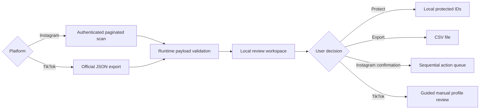

<p align="center">
  
</p>

<h1 align="center">Follow Audit</h1>

<p align="center">
  A focused, local-first workspace for reviewing who you follow and who follows you on Instagram or TikTok.
  <br>
  Inspect first. Protect what matters. Act only when you are ready.
</p>

<p align="center">
  <a href="https://marquezinii.github.io/follow-audit/"><strong>Open Follow Audit &mdash; copy the script</strong></a>
</p>

<p align="center">
  <a href="https://github.com/marquezinii/follow-audit/actions/workflows/ci.yml"></a>
  <a href="https://github.com/marquezinii/follow-audit/blob/main/LICENSE"></a>
  
  
</p>

---

Follow Audit runs entirely inside your browser. On Instagram, it scans both sides of your connections and provides an explicit review flow for account actions. On TikTok, it reads the follower and following JSON files from your official data export, compares them locally, and keeps all account changes manual.

No account data is sent to a project server. Session credentials are read only when a request needs them and are never stored by the application.

> [!CAUTION]
> Instagram support relies on private web endpoints. Those endpoints can change without notice, and high-volume account actions may trigger platform limits. TikTok support is read-only and uses only files you explicitly select. This project is not affiliated with or endorsed by Instagram, Meta, TikTok, or ByteDance.

## What it does

| Capability | Behavior |
| --- | --- |
| Instagram audits | Loads either list page by page and deduplicates results. |
| TikTok audits | Imports the official `Follower.json` and `Following.json` files and derives mutual relationships locally. |
| Focused review | Highlights accounts that do not follow you back or followers you do not follow back. |
| Protected accounts | Stores protected account IDs locally and permanently excludes them from the action queue. |
| Deliberate actions | On Instagram, unfollows or removes followers only after confirmation, one at a time, with cancellation. TikTok offers a local guided-review queue that opens one profile at a time; changes remain manual. |
| Portable results | Exports the current review view as spreadsheet-safe CSV. |
| Local preview | Uses deterministic sample data and never contacts either platform during UI development. |

## Safety by construction

The destructive path is intentionally slower than the review path:

- unfollow and follower-removal requests are never retried automatically;
- every run requires an explicit confirmation;
- protected accounts cannot be selected;
- the queue is sequential, cancellable, and delay-controlled;
- malformed API payloads fail closed instead of reaching the interface;
- exported CSV cells are escaped against spreadsheet formula injection;
- cookies and CSRF tokens never enter storage, exports, logs, or application state.

## Quick start

1. Open the [Follow Audit website](https://marquezinii.github.io/follow-audit/).
2. Select **Copy script**.
3. Open [Instagram](https://www.instagram.com/) or [TikTok](https://www.tiktok.com/) in the same browser.
4. Open your browser's Developer Tools, switch to **Console**, paste the script, and press <kbd>Enter</kbd>.
5. On Instagram, choose a list and run the audit. On TikTok, import the extracted `Follower.json` and `Following.json` files from **Settings and privacy → Account → Download your data**; request JSON format.

The bundle refuses to start outside `instagram.com` or `tiktok.com`, except on localhost where it enters preview mode. Add `?platform=tiktok` to the preview URL to inspect the TikTok read-only state.

## How it works



The UI is mounted in a Shadow DOM overlay, so the application remains isolated from the platform's styles. The production bundle contains no framework and ships with zero runtime dependencies.

## Development

### Requirements

- Node.js 22
- npm

### Setup

```bash
git clone https://github.com/marquezinii/follow-audit.git
cd follow-audit
npm ci
npm run dev
```

The local server opens at `http://127.0.0.1:8080/`. Preview mode uses sample accounts; it does not require a login and cannot perform a real unfollow or follower removal.

### Quality gate

```bash
npm run check
```

This single command runs ESLint, the Node test suite, TypeScript type checking, website validation, and the production build. GitHub Actions runs the same checks for every pull request and every push to `main`.

### Project map

```text
src/
├── core.ts          # validation, pagination, cancellation, serial execution
├── instagram.ts     # authenticated Instagram request boundary
├── tiktok.ts        # official export parser and relationship comparison
└── main.ts          # Shadow DOM interface and browser state
tests/
└── core.test.ts     # deterministic checks for the critical logic
public/              # project website and distributable bundle
scripts/             # build copy and local static server
```

## Privacy model

| Data | Handling |
| --- | --- |
| Session cookies | Read by the browser request boundary; never persisted by Follow Audit. |
| CSRF token | Read immediately before an unfollow or follower-removal request; never exported or logged. |
| Following and follower lists | Held in memory for the current run. Selected TikTok files are never uploaded. |
| Protected IDs | Stored only in the current browser's `localStorage`. |
| Analytics | None. |
| Project backend | None. |

## Known constraints

- Instagram can change its internal request contracts at any time.
- A successful HTTP response does not guarantee that the platform will allow continued high-volume activity.
- Instagram audits must run in the same browser profile as the authenticated session.
- TikTok exports can lag behind recent account changes and must be requested in JSON format and extracted before import.
- TikTok actions are intentionally manual; Follow Audit does not scrape or call private TikTok relationship endpoints.
- Closing or reloading the tab ends the active scan or queue.

## Contributing

Read [CONTRIBUTING.md](CONTRIBUTING.md) before opening a pull request. Changes to request handling or destructive actions must include focused tests and preserve the safety properties above.

Security-sensitive reports belong in a private [GitHub Security Advisory](https://github.com/marquezinii/follow-audit/security/advisories/new), not a public issue. See [SECURITY.md](SECURITY.md).

## License

Released under the [MIT License](LICENSE). Copyright © 2026 marquezinii.
