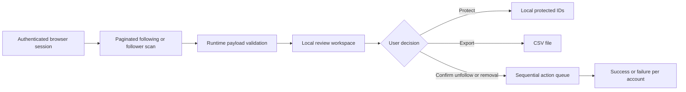

<p align="center">
  
</p>

<h1 align="center">Follow Audit</h1>

<p align="center">
  A focused, local-first workspace for reviewing who you follow and who follows you on Instagram.
  <br>
  Inspect first. Protect what matters. Act only when you are ready.
</p>

<p align="center">
  <a href="https://marquezinii.github.io/follow-audit/"><strong>Open Follow Audit &mdash; copy the script</strong></a>
</p>

<p align="center">
  <a href="https://github.com/marquezinii/follow-audit/actions/workflows/ci.yml"></a>
  <a href="https://github.com/marquezinii/follow-audit/blob/main/LICENSE"></a>
  
  
</p>

---

Follow Audit runs entirely inside your browser session. It scans both sides of your Instagram connections, highlights non-mutual relationships, keeps a private protection list, and turns unfollows or follower removals into an explicit review process.

No account data is sent to a project server. Session credentials are read only when a request needs them and are never stored by the application.

> [!CAUTION]
> Follow Audit relies on private Instagram web endpoints. Those endpoints can change without notice, and high-volume account actions may trigger platform limits. This project is not affiliated with, endorsed by, or sponsored by Instagram or Meta.

## What it does

| Capability | Behavior |
| --- | --- |
| Following and follower audits | Loads either list page by page and deduplicates results. |
| Focused review | Highlights accounts that do not follow you back or followers you do not follow back. |
| Protected accounts | Stores protected account IDs locally and permanently excludes them from the action queue. |
| Deliberate actions | Unfollows accounts or removes followers only after confirmation, one at a time, with cancellation. |
| Portable results | Exports the current review view as spreadsheet-safe CSV. |
| Local preview | Uses deterministic sample data and never contacts Instagram during UI development. |

## Safety by construction

The destructive path is intentionally slower than the review path:

- unfollow and follower-removal requests are never retried automatically;
- every run requires an explicit confirmation;
- protected accounts cannot be selected;
- the queue is sequential, cancellable, and delay-controlled;
- malformed API payloads fail closed instead of reaching the interface;
- exported CSV cells are escaped against spreadsheet formula injection;
- cookies and CSRF tokens never enter storage, exports, logs, or application state.

## Quick start

1. Open the [Follow Audit website](https://marquezinii.github.io/follow-audit/).
2. Select **Copy script**.
3. Sign in to [Instagram](https://www.instagram.com/) in the same browser.
4. Open your browser's Developer Tools, switch to **Console**, paste the script, and press <kbd>Enter</kbd>.
5. Choose **Following** or **Followers**, run the audit, and select only the accounts you intend to unfollow or remove.

The bundle refuses to start outside `instagram.com`, except on localhost where it enters preview mode.

## How it works



The UI is mounted in a Shadow DOM overlay, so the application remains isolated from Instagram's styles. The production bundle contains no framework and ships with zero runtime dependencies.

## Development

### Requirements

- Node.js 22
- npm

### Setup

```bash
git clone https://github.com/marquezinii/follow-audit.git
cd follow-audit
npm ci
npm run dev
```

The local server opens at `http://127.0.0.1:8080/`. Preview mode uses sample accounts; it does not require a login and cannot perform a real unfollow or follower removal.

### Quality gate

```bash
npm run check
```

This single command runs ESLint, the Node test suite, TypeScript type checking, and the production build. GitHub Actions runs the same checks for every pull request and every push to `main`.

### Project map

```text
src/
├── core.ts          # validation, pagination, cancellation, serial execution
├── instagram.ts     # authenticated Instagram request boundary
└── main.ts          # Shadow DOM interface and browser state
tests/
└── core.test.ts     # deterministic checks for the critical logic
public/              # project website and distributable bundle
scripts/             # build copy and local static server
```

## Privacy model

| Data | Handling |
| --- | --- |
| Session cookies | Read by the browser request boundary; never persisted by Follow Audit. |
| CSRF token | Read immediately before an unfollow or follower-removal request; never exported or logged. |
| Following and follower lists | Held in memory for the current run. |
| Protected IDs | Stored only in the current browser's `localStorage`. |
| Analytics | None. |
| Project backend | None. |

## Known constraints

- Instagram can change its internal request contracts at any time.
- A successful HTTP response does not guarantee that the platform will allow continued high-volume activity.
- The tool must run in the same browser profile as the authenticated Instagram session.
- Closing or reloading the tab ends the active scan or queue.

## Contributing

Read [CONTRIBUTING.md](CONTRIBUTING.md) before opening a pull request. Changes to request handling or destructive actions must include focused tests and preserve the safety properties above.

Security-sensitive reports belong in a private [GitHub Security Advisory](https://github.com/marquezinii/follow-audit/security/advisories/new), not a public issue. See [SECURITY.md](SECURITY.md).

## License

Released under the [MIT License](LICENSE). Copyright © 2026 marquezinii.
